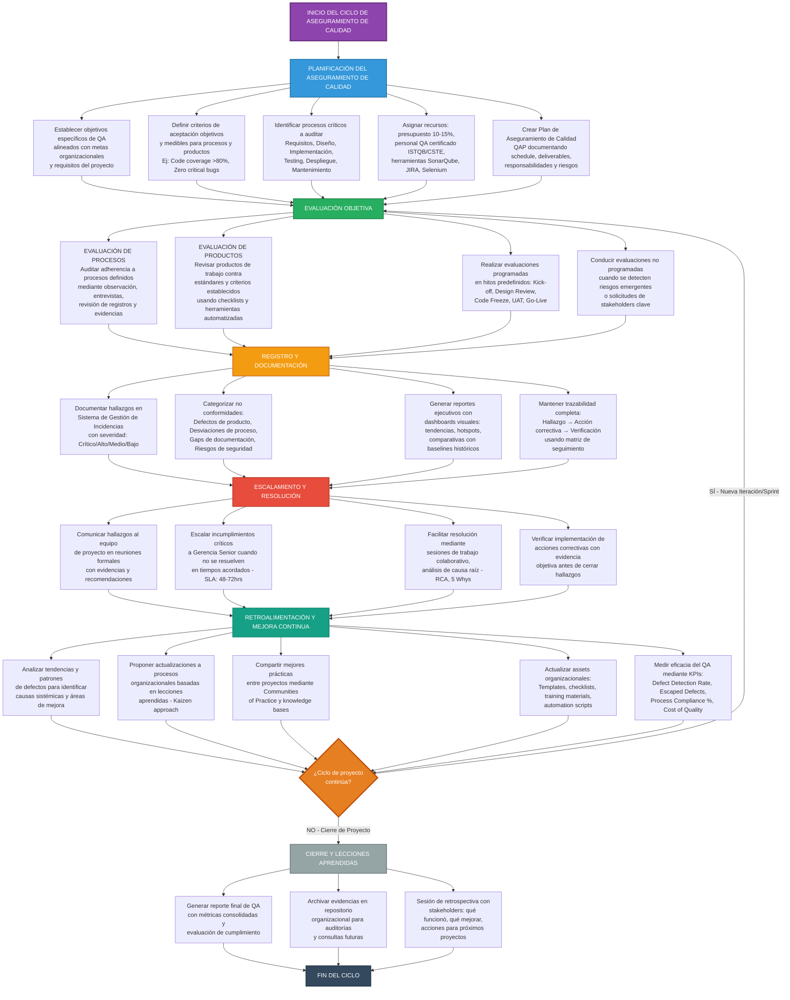

# Topico_Ing_Software

# Diagrama 1

```mermaid
graph TD
    A[ASEGURAMIENTO DE CALIDAD DE PROCESOS Y PRODUCTOS<br/>PPQA - Process and Product Quality Assurance]
    
    A --> B[OBJETIVO GENERAL]
    A --> C[PROPÓSITO ESTRATÉGICO]
    A --> D[NOTAS INTRODUCTORIAS]
    
    B --> B1[Proporcionar al personal y la gerencia<br/>una visión objetiva de los procesos<br/>y productos de trabajo asociados]
    B --> B2[Garantizar que los procesos definidos<br/>se ejecuten según lo planificado y<br/>cumplan con los estándares organizacionales]
    B --> B3[Identificar y documentar incumplimientos<br/>en procesos y productos para su<br/>resolución oportuna]
    B --> B4[Establecer mecanismos de retroalimentación<br/>que promuevan la mejora continua<br/>en toda la organización]
    
    C --> C1[Reducir costos asociados a defectos<br/>y retrabajos mediante detección temprana<br/>de desviaciones - ROI: 300-500%]
    C --> C2[Mantener conformidad con normativas<br/>ISO 9001, CMMI, ISO 27001, GDPR<br/>y regulaciones industriales específicas]
    C --> C3[Incrementar la confianza del cliente<br/>en la capacidad de entrega de<br/>productos de alta calidad]
    C --> C4[Habilitar certificaciones y auditorías<br/>externas que agreguen valor comercial<br/>y competitivo a la organización]
    
    D --> D1[CONTEXTO ORGANIZACIONAL:<br/>El PPQA opera como función transversal<br/>que atraviesa todos los proyectos<br/>y áreas de desarrollo de software]
    D --> D2[MÉTRICAS CLAVE:<br/>- Esfuerzo: 8-12% del esfuerzo total del proyecto<br/>- Tiempo: Revisiones cada 2-4 semanas<br/>- Cobertura: 100% de hitos críticos]
    D --> D3[ALCANCE:<br/>Incluye código fuente, documentación técnica,<br/>artefactos de diseño, casos de prueba,<br/>configuraciones, y entregables al cliente]
    D --> D4[INDEPENDENCIA:<br/>El equipo QA debe reportar a nivel<br/>organizacional, no al gerente de proyecto,<br/>para garantizar objetividad y autonomía]
    D --> D5[ENFOQUE PREVENTIVO Y CORRECTIVO:<br/>No solo detectar problemas sino prevenir<br/>su ocurrencia mediante capacitación,<br/>templates, checklists y automatización]
    D --> D6[INTEGRACIÓN CONTINUA:<br/>Integrar QA en DevOps/CI-CD pipeline<br/>con gates de calidad automatizados<br/>y métricas en tiempo real]
    
    style A fill:#2C3E50,stroke:#E74C3C,stroke-width:4px,color:#ECF0F1
    style B fill:#3498DB,stroke:#2980B9,stroke-width:3px,color:#FFF
    style C fill:#27AE60,stroke:#229954,stroke-width:3px,color:#FFF
    style D fill:#E67E22,stroke:#D35400,stroke-width:3px,color:#FFF
```

# Diagrama 2

```mermaid
graph TB
    START[INICIO DEL CICLO DE ASEGURAMIENTO DE CALIDAD]
    
    START --> PLAN[PLANIFICACIÓN DEL ASEGURAMIENTO DE CALIDAD]
    
    PLAN --> PLAN1[Establecer objetivos específicos de QA<br/>alineados con metas organizacionales<br/>y requisitos del proyecto]
    PLAN --> PLAN2[Definir criterios de aceptación objetivos<br/>y medibles para procesos y productos<br/>Ej: Code coverage >80%, Zero critical bugs]
    PLAN --> PLAN3[Identificar procesos críticos a auditar<br/>Requisitos, Diseño, Implementación,<br/>Testing, Despliegue, Mantenimiento]
    PLAN --> PLAN4[Asignar recursos: presupuesto 10-15%,<br/>personal QA certificado ISTQB/CSTE,<br/>herramientas SonarQube, JIRA, Selenium]
    PLAN --> PLAN5[Crear Plan de Aseguramiento de Calidad<br/>QAP documentando schedule, deliverables,<br/>responsabilidades y riesgos]
    
    PLAN1 & PLAN2 & PLAN3 & PLAN4 & PLAN5 --> EVAL
    
    EVAL[EVALUACIÓN OBJETIVA]
    
    EVAL --> EVAL1[EVALUACIÓN DE PROCESOS<br/>Auditar adherencia a procesos definidos<br/>mediante observación, entrevistas,<br/>revisión de registros y evidencias]
    EVAL --> EVAL2[EVALUACIÓN DE PRODUCTOS<br/>Revisar productos de trabajo contra<br/>estándares y criterios establecidos<br/>usando checklists y herramientas automatizadas]
    EVAL --> EVAL3[Realizar evaluaciones programadas<br/>en hitos predefinidos: Kick-off, Design Review,<br/>Code Freeze, UAT, Go-Live]
    EVAL --> EVAL4[Conducir evaluaciones no programadas<br/>cuando se detecten riesgos emergentes<br/>o solicitudes de stakeholders clave]
    
    EVAL1 & EVAL2 & EVAL3 & EVAL4 --> REG
    
    REG[REGISTRO Y DOCUMENTACIÓN]
    
    REG --> REG1[Documentar hallazgos en<br/>Sistema de Gestión de Incidencias<br/>con severidad: Crítico/Alto/Medio/Bajo]
    REG --> REG2[Categorizar no conformidades:<br/>Defectos de producto, Desviaciones de proceso,<br/>Gaps de documentación, Riesgos de seguridad]
    REG --> REG3[Generar reportes ejecutivos con<br/>dashboards visuales: tendencias, hotspots,<br/>comparativas con baselines históricos]
    REG --> REG4[Mantener trazabilidad completa:<br/>Hallazgo → Acción correctiva → Verificación<br/>usando matriz de seguimiento]
    
    REG1 & REG2 & REG3 & REG4 --> ESC
    
    ESC[ESCALAMIENTO Y RESOLUCIÓN]
    
    ESC --> ESC1[Comunicar hallazgos al equipo<br/>de proyecto en reuniones formales<br/>con evidencias y recomendaciones]
    ESC --> ESC2[Escalar incumplimientos críticos<br/>a Gerencia Senior cuando no se resuelven<br/>en tiempos acordados - SLA: 48-72hrs]
    ESC --> ESC3[Facilitar resolución mediante<br/>sesiones de trabajo colaborativo,<br/>análisis de causa raíz - RCA, 5 Whys]
    ESC --> ESC4[Verificar implementación de<br/>acciones correctivas con evidencia<br/>objetiva antes de cerrar hallazgos]
    
    ESC1 & ESC2 & ESC3 & ESC4 --> RET
    
    RET[RETROALIMENTACIÓN Y MEJORA CONTINUA]
    
    RET --> RET1[Analizar tendencias y patrones<br/>de defectos para identificar<br/>causas sistémicas y áreas de mejora]
    RET --> RET2[Proponer actualizaciones a procesos<br/>organizacionales basadas en lecciones<br/>aprendidas - Kaizen approach]
    RET --> RET3[Compartir mejores prácticas<br/>entre proyectos mediante Communities<br/>of Practice y knowledge bases]
    RET --> RET4[Actualizar assets organizacionales:<br/>Templates, checklists, training materials,<br/>automation scripts]
    RET --> RET5[Medir eficacia del QA mediante KPIs:<br/>Defect Detection Rate, Escaped Defects,<br/>Process Compliance %, Cost of Quality]
    
    RET1 & RET2 & RET3 & RET4 & RET5 --> DECISION{¿Ciclo de proyecto<br/>continúa?}
    
    DECISION -->|SÍ - Nueva Iteración/Sprint| EVAL
    DECISION -->|NO - Cierre de Proyecto| CLOSE
    
    CLOSE[CIERRE Y LECCIONES APRENDIDAS]
    CLOSE --> CLOSE1[Generar reporte final de QA<br/>con métricas consolidadas y<br/>evaluación de cumplimiento]
    CLOSE --> CLOSE2[Archivar evidencias en repositorio<br/>organizacional para auditorías<br/>y consultas futuras]
    CLOSE --> CLOSE3[Sesión de retrospectiva con<br/>stakeholders: qué funcionó, qué mejorar,<br/>acciones para próximos proyectos]
    
    CLOSE1 & CLOSE2 & CLOSE3 --> END[FIN DEL CICLO]
    
    style START fill:#8E44AD,stroke:#6C3483,stroke-width:3px,color:#FFF
    style PLAN fill:#3498DB,stroke:#2874A6,stroke-width:2px,color:#FFF
    style EVAL fill:#27AE60,stroke:#1E8449,stroke-width:2px,color:#FFF
    style REG fill:#F39C12,stroke:#CA6F1E,stroke-width:2px,color:#FFF
    style ESC fill:#E74C3C,stroke:#C0392B,stroke-width:2px,color:#FFF
    style RET fill:#16A085,stroke:#138D75,stroke-width:2px,color:#FFF
    style DECISION fill:#E67E22,stroke:#BA4A00,stroke-width:3px,color:#FFF
    style CLOSE fill:#95A5A6,stroke:#707B7C,stroke-width:2px,color:#FFF
    style END fill:#34495E,stroke:#2C3E50,stroke-width:3px,color:#FFF
```

    
