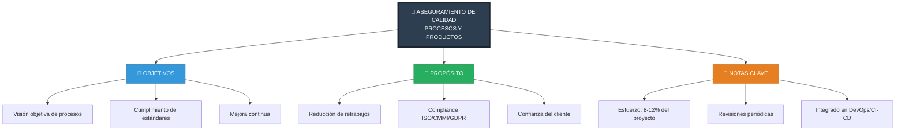

# Aseguramiento de calidad de procesos y productos

# Diagrama 1



# Diagrama 2

```mermaid
graph TD
    A[🎯 INICIO DEL CICLO QA]

    A --> B[📘 Planificación]
    A --> C[🔍 Evaluación]
    A --> D[📝 Registro]
    A --> E[⚠️ Escalamiento]
    A --> F[♻️ Mejora Continua]
    A --> G{❓ ¿Continúa el proyecto?}
    G -->|Sí| C
    G -->|No| H[📦 Cierre]

    B --> B1[Definir objetivos QA]
    B --> B2[Criterios medibles]
    B --> B3[Procesos críticos]
    B --> B4[Recursos y herramientas]

    C --> C1[Auditoría de procesos]
    C --> C2[Evaluación de productos]
    C --> C3[Revisiones en hitos]

    D --> D1[Registrar hallazgos]
    D --> D2[Clasificar no conformidades]
    D --> D3[Reportes ejecutivos]

    E --> E1[Comunicación al equipo]
    E --> E2[Escalar a gerencia]
    E --> E3[Resolución colaborativa]

    F --> F1[Analizar tendencias]
    F --> F2[Actualizar procesos]
    F --> F3[Compartir buenas prácticas]
    F --> F4[Medir KPIs]

    H --> H1[Reporte final QA]
    H --> H2[Archivar evidencias]
    H --> H3[Retrospectiva con stakeholders]

    style A fill:#2C3E50,stroke:#1A252F,stroke-width:4px,color:#FFF
    style B fill:#3498DB,stroke:#2874A6,color:#FFF
    style C fill:#27AE60,stroke:#1E8449,color:#FFF
    style D fill:#F39C12,stroke:#CA6F1E,color:#FFF
    style E fill:#E74C3C,stroke:#C0392B,color:#FFF
    style F fill:#16A085,stroke:#138D75,color:#FFF
    style G fill:#E67E22,stroke:#BA4A00,color:#FFF
    style H fill:#95A5A6,stroke:#707B7C,color:#FFF

```



# Diagrama 3

```mermaid
```mermaid
%% Diagrama 3 - Actores y conexiones (PPQA)
graph TD
    %% Actores (etiquetas cortas con referencias numéricas)
    A1[1. 🎩 Alta Dirección]
    A2[2. 🛡️ Dirección de Calidad (PPQA)]
    A3[3. 📂 Jefe(s) de Proyecto]
    A4[4. 📊 Product Owner]
    A5[5. 🏗️ Arquitecto Técnico]
    A6[6. 💻 Equipo de Desarrollo]
    A7[7. 🚀 DevOps / CI-CD]
    A8[8. 🔍 Equipo QA]
    A9[9. 🔐 Especialista Seguridad]
    A10[10. 📈 Analista KPIs / Métricas]
    A11[11. 🤝 Cliente / Usuarios]
    A12[12. ✅ Auditor Externo / Compliance]
    A13[13. 🔄 Mejora Continua (Kaizen)]

    %% Jerarquía principal y enlaces
    A1 --> A2
    A1 --> A3
    A2 --> A3
    A3 --> A4
    A3 --> A5
    A3 --> A6
    A6 --> A7
    A6 --> A8
    A7 --> A8
    A9 --> A8
    A8 --> A10
    A10 --> A2
    A11 --> A3
    A11 --> A8
    A12 --> A2

    %% Conexiones cruzadas importantes
    A2 --> A7
    A2 --> A9
    A1 --> A10
    A5 --> A6
    A5 --> A8
    A8 --> A3
    A7 --> A6
    A9 --> A7

    %% Mejora continua (retroalimentación)
    A2 --> A13
    A3 --> A13
    A6 --> A13
    A8 --> A13
    A10 --> A13
    A13 -.-> A2
    A13 -.-> A3
    A13 -.-> A6
    A13 -.-> A8
    A13 -.-> A10

    %% Notas detalladas (todo el detalle se mantiene aquí, referenciado por número)
    subgraph NOTAS["Notas detalladas (referencias por número)"]
        direction TB
        N1["1. Alta Dirección: Define políticas, aprueba presupuesto y objetivos estratégicos de calidad; decide escalamiento y métricas de negocio."]
        N2["2. Dirección de Calidad (PPQA): Diseña QAP, define quality gates, planifica auditorías, mantiene independencia operativa para evaluación objetiva."]
        N3["3. Jefe(s) de Proyecto: Integra QA en la planificación y cronograma, gestiona recursos, SLAs y comunicación con stakeholders y dirección."]
        N4["4. Product Owner: Define criterios de aceptación, prioriza backlog según riesgo/valor, participa en UAT y decisiones de release."]
        N5["5. Arquitecto Técnico: Establece estándares de arquitectura, patrones, performance y guías de seguridad aplicables al producto."]
        N6["6. Equipo de Desarrollo: Implementa funcionalidades, unit/integration tests, code reviews; atiende defects y colabora con QA/DevOps."]
        N7["7. DevOps / CI-CD: Configura pipelines, quality gates, despliegues reproducibles, rollbacks, secretos y monitoreo continuo."]
        N8["8. Equipo QA: Auditorías de proceso, pruebas funcionales/automatizadas, regresión, UAT, gestión de incidencias y verificación de correcciones."]
        N9["9. Especialista Seguridad: SAST/DAST, revisión de infra, gestión de secretos/tokens, encriptación, cumplimiento ISO27001/GDPR."]
        N10["10. Analista KPIs: Consolida métricas (Defect Detection Rate, Escaped Defects, Test Coverage, Cycle Time), crea dashboards y alertas de tendencia."]
        N11["11. Cliente/Usuarios: Participa en UAT, entrega feedback funcional y acepta releases según criterios acordados."]
        N12["12. Auditor Externo: Valida compliance, emite certificaciones (ISO/CMMI), revisa evidencia y sugiere mejoras normativas."]
        N13["13. Mejora Continua: Ciclo Kaizen -> convertir hallazgos en acciones (templates, trainings, actualización de procesos, automations)."]
    end

    %% Estilos (paleta sobria y legible)
    classDef purple fill:#8E44AD,stroke:#6C3483,color:#fff;
    classDef blue fill:#3498DB,stroke:#2874A6,color:#fff;
    classDef green fill:#27AE60,stroke:#1E8449,color:#fff;
    classDef orange fill:#F39C12,stroke:#CA6F1E,color:#000;
    classDef red fill:#E74C3C,stroke:#C0392B,color:#fff;
    classDef gray fill:#95A5A6,stroke:#707B7C,color:#fff;
    classDef teal fill:#16A085,stroke:#117864,color:#fff;

    class A1 purple
    class A2 blue
    class A3 green
    class A4 green
    class A5 orange
    class A6 orange
    class A7 orange
    class A8 red
    class A9 red
    class A10 purple
    class A11 gray
    class A12 gray
    class A13 teal
```

```

# Diagrama 4

```mermaid
graph TD
    START[🎯 STACK TECNOLÓGICO DE ASEGURAMIENTO DE CALIDAD]
    
    START --> CAPA1
    
    subgraph CAPA1[" "]
        direction TB
        A1[📊 DASHBOARDS Y REPORTES]
        A1 --> A2[Power BI / Grafana]
        A2 --> A3[Métricas en tiempo real y tendencias]
    end
    
    CAPA1 --> CAPA2
    
    subgraph CAPA2[" "]
        direction TB
        B1[📋 GESTIÓN DE PROYECTOS]
        B1 --> B2[JIRA / Azure DevOps]
        B2 --> B3[Seguimiento de defectos y sprints]
        B3 --> B4[TestRail / Zephyr]
        B4 --> B5[Gestión de casos de prueba]
    end
    
    CAPA2 --> CAPA3
    
    subgraph CAPA3[" "]
        direction TB
        C1[💻 ANÁLISIS DE CÓDIGO]
        C1 --> C2[SonarQube]
        C2 --> C3[Code quality, cobertura >80%, quality gates]
        C3 --> C4[GitHub / GitLab]
        C4 --> C5[Code reviews y pull requests]
    end
    
    CAPA3 --> CAPA4
    
    subgraph CAPA4[" "]
        direction TB
        D1[🧪 PRUEBAS AUTOMATIZADAS]
        D1 --> D2[JUnit / pytest - Pruebas unitarias]
        D2 --> D3[Postman / RestAssured - Pruebas de APIs]
        D3 --> D4[Selenium / Cypress - Pruebas E2E]
        D4 --> D5[JMeter / Gatling - Pruebas de rendimiento]
    end
    
    CAPA4 --> CAPA5
    
    subgraph CAPA5[" "]
        direction TB
        E1[🔐 SEGURIDAD]
        E1 --> E2[Fortify / Checkmarx - SAST]
        E2 --> E3[OWASP ZAP - DAST]
        E3 --> E4[Snyk / Dependabot - Análisis de dependencias]
        E4 --> E5[HashiCorp Vault - Gestión de secretos]
    end
    
    CAPA5 --> CAPA6
    
    subgraph CAPA6[" "]
        direction TB
        F1[🚀 CI/CD Y DESPLIEGUE]
        F1 --> F2[Jenkins / GitHub Actions]
        F2 --> F3[Pipeline automatizado con quality gates]
        F3 --> F4[Docker / Kubernetes]
        F4 --> F5[Contenedores y orquestación]
        F5 --> F6[Prometheus / Datadog]
        F6 --> F7[Monitoreo y observabilidad]
    end
    
    CAPA6 --> CAPA7
    
    subgraph CAPA7[" "]
        direction TB
        G1[💾 DATOS Y CUMPLIMIENTO]
        G1 --> G2[PostgreSQL / MongoDB - Bases de datos encriptadas]
        G2 --> G3[TLS 1.3 / AES-256 - Encriptación]
        G3 --> G4[OAuth 2.0 / JWT - Autenticación]
        G4 --> G5[GDPR / ISO 27001 - Cumplimiento normativo]
    end
    
    CAPA7 --> CAPA8
    
    subgraph CAPA8[" "]
        direction TB
        H1[🔔 NOTIFICACIONES]
        H1 --> H2[Slack / MS Teams]
        H2 --> H3[Alertas en tiempo real de issues y quality gates]
    end
    
    CAPA8 --> FIN
    
    FIN[✅ CICLO COMPLETO INTEGRADO]
    FIN -.->|Métricas| A1
    
    style START fill:#8E44AD,stroke:#6C3483,stroke-width:4px,color:#FFF,font-size:16px
    style CAPA1 fill:#3498DB,stroke:#2874A6,stroke-width:3px,color:#000
    style CAPA2 fill:#1ABC9C,stroke:#148F77,stroke-width:3px,color:#000
    style CAPA3 fill:#27AE60,stroke:#1E8449,stroke-width:3px,color:#000
    style CAPA4 fill:#F39C12,stroke:#CA6F1E,stroke-width:3px,color:#000
    style CAPA5 fill:#E74C3C,stroke:#C0392B,stroke-width:3px,color:#FFF
    style CAPA6 fill:#9B59B6,stroke:#7D3C98,stroke-width:3px,color:#FFF
    style CAPA7 fill:#E67E22,stroke:#BA4A00,stroke-width:3px,color:#FFF
    style CAPA8 fill:#34495E,stroke:#2C3E50,stroke-width:3px,color:#FFF
    style FIN fill:#16A085,stroke:#138D75,stroke-width:4px,color:#FFF,font-size:16px
```


    
