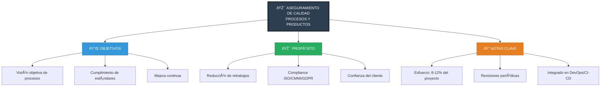
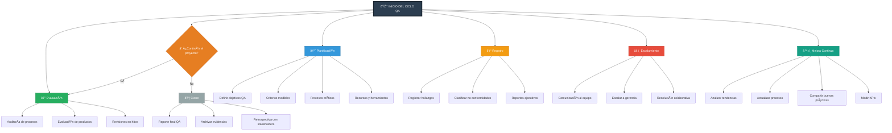

# Aseguramiento de calidad de procesos y productos

# Diagrama 1

```mermaid
graph TD
    A[🎯 ASEGURAMIENTO DE CALIDAD<br/>PROCESOS Y PRODUCTOS]
    A --> B1[📌 OBJETIVOS]
    A --> B2[🎯 PROPÓSITO]
    A --> B3[📠NOTAS CLAVE]

    B1 --> C1[Visión objetiva de procesos]
    B1 --> C2[Cumplimiento de estándares]
    B1 --> C3[Mejora continua]

    B2 --> C4[Reducción de retrabajos]
    B2 --> C5[Compliance ISO/CMMI/GDPR]
    B2 --> C6[Confianza del cliente]

    B3 --> C7[Esfuerzo: 8-12% del proyecto]
    B3 --> C8[Revisiones periódicas]
    B3 --> C9[Integrado en DevOps/CI-CD]

    style A fill:#2C3E50,stroke:#1A252F,stroke-width:4px,color:#FFF
    style B1 fill:#3498DB,stroke:#2874A6,color:#FFF
    style B2 fill:#27AE60,stroke:#1E8449,color:#FFF
    style B3 fill:#E67E22,stroke:#CA6F1E,color:#FFF

```

# Diagrama 2

```mermaid
graph TD
    A[🎯 INICIO DEL CICLO QA]

    A --> B[📘 Planificación]
    A --> C[🔠Evaluación]
    A --> D[📠Registro]
    A --> E[âš ï¸ Escalamiento]
    A --> F[â™»ï¸ Mejora Continua]
    A --> G{ⓠ¿Continúa el proyecto?}
    G -->|Sí| C
    G -->|No| H[📦 Cierre]

    B --> B1[Definir objetivos QA]
    B --> B2[Criterios medibles]
    B --> B3[Procesos críticos]
    B --> B4[Recursos y herramientas]

    C --> C1[Auditoría de procesos]
    C --> C2[Evaluación de productos]
    C --> C3[Revisiones en hitos]

    D --> D1[Registrar hallazgos]
    D --> D2[Clasificar no conformidades]
    D --> D3[Reportes ejecutivos]

    E --> E1[Comunicación al equipo]
    E --> E2[Escalar a gerencia]
    E --> E3[Resolución colaborativa]

    F --> F1[Analizar tendencias]
    F --> F2[Actualizar procesos]
    F --> F3[Compartir buenas prácticas]
    F --> F4[Medir KPIs]

    H --> H1[Reporte final QA]
    H --> H2[Archivar evidencias]
    H --> H3[Retrospectiva con stakeholders]

    style A fill:#2C3E50,stroke:#1A252F,stroke-width:4px,color:#FFF
    style B fill:#3498DB,stroke:#2874A6,color:#FFF
    style C fill:#27AE60,stroke:#1E8449,color:#FFF
    style D fill:#F39C12,stroke:#CA6F1E,color:#FFF
    style E fill:#E74C3C,stroke:#C0392B,color:#FFF
    style F fill:#16A085,stroke:#138D75,color:#FFF
    style G fill:#E67E22,stroke:#BA4A00,color:#FFF
    style H fill:#95A5A6,stroke:#707B7C,color:#FFF

```

# Diagrama 3

```mermaid
graph TD
    A[🎯 Proceso de Aseguramiento de Calidad]

    A --> B[👔 Alta Dirección]
    B --> B1[Define políticas y presupuesto]
    B --> B2[Aprueba estándares]

    A --> C[👨â€ðŸ’¼ Dirección de Calidad]
    C --> C1[Estrategia y métricas]
    C --> C2[Lidera equipo QA]

    A --> D[📊 Jefe de Proyecto]
    D --> D1[Integra QA en cronograma]
    D --> D2[📠Product Owner - Define criterios]
    D --> D3[ðŸ—ï¸ Arquitecto - Estándares técnicos]

    A --> E[💻 Desarrollo]
    E --> E1[Implementación y unit tests]
    E --> E2[Code reviews]
    E --> E3[🚀 DevOps - CI/CD + quality gates]

    A --> F[🔠QA]
    F --> F1[Auditorías de procesos]
    F --> F2[Pruebas funcionales y automatizadas]
    F --> F3[🔠Seguridad - SAST/DAST]

    A --> G[📊 Reporte de Métricas]
    G --> G1[KPIs y dashboards]
    G --> G2[Análisis de tendencias]

    A --> H[🤠Externos]
    H --> H1[Cliente - UAT y releases]
    H --> H2[✅ Auditor externo - Compliance]

    H --> I[🔄 Mejora Continua]
    I -.-> C

    style A fill:#2C3E50,stroke:#1A252F,stroke-width:4px,color:#FFF
    style B fill:#2980B9,stroke:#1F618D,color:#FFF
    style C fill:#27AE60,stroke:#1E8449,color:#FFF
    style D fill:#27AE60,stroke:#1E8449,color:#FFF
    style E fill:#27AE60,stroke:#1E8449,color:#FFF
    style F fill:#C0392B,stroke:#922B21,color:#FFF
    style G fill:#9B59B6,stroke:#7D3C98,color:#FFF
    style H fill:#7F8C8D,stroke:#626567,color:#FFF
    style I fill:#16A085,stroke:#117864,stroke-width:3px,color:#FFF

```

# Diagrama 4

```mermaid
graph LR
    START[🎯 STACK TECNOLÓGICO DE ASEGURAMIENTO DE CALIDAD]

    %% Dashboards
    subgraph CAPA1["📊 DASHBOARDS Y REPORTES"]
        A1[Power BI / Grafana]
        A2[Métricas en tiempo real y tendencias]
        A1 --> A2
    end

    %% Gestión de proyectos
    subgraph CAPA2["📋 GESTIÓN DE PROYECTOS"]
        B1[JIRA / Azure DevOps]
        B2[Seguimiento de defectos y sprints]
        B3[TestRail / Zephyr - Gestión de casos de prueba]
        B1 --> B2 --> B3
    end

    %% Análisis de código
    subgraph CAPA3["💻 ANÃLISIS DE CÓDIGO"]
        C1[SonarQube]
        C2[Code quality, cobertura >80%, quality gates]
        C3[GitHub / GitLab - Code reviews & PRs]
        C1 --> C2 --> C3
    end

    %% Pruebas automatizadas
    subgraph CAPA4["🧪 PRUEBAS AUTOMATIZADAS"]
        D1[JUnit / pytest - Unit tests]
        D2[Postman / RestAssured - API tests]
        D3[Selenium / Cypress - E2E]
        D4[JMeter / Gatling - Rendimiento]
        D1 --> D2 --> D3 --> D4
    end

    %% Seguridad
    subgraph CAPA5["🔠SEGURIDAD"]
        E1[Fortify / Checkmarx - SAST]
        E2[OWASP ZAP - DAST]
        E3[Snyk / Dependabot - Análisis de dependencias]
        E4[HashiCorp Vault - Gestión de secretos]
        E1 --> E2 --> E3 --> E4
    end

    %% CI/CD y despliegue
    subgraph CAPA6["🚀 CI/CD Y DESPLIEGUE"]
        F1[Jenkins / GitHub Actions]
        F2[Pipeline automatizado con quality gates]
        F3[Docker / Kubernetes - Contenedores y orquestación]
        F4[Prometheus / Datadog - Monitoreo]
        F1 --> F2 --> F3 --> F4
    end

    %% Datos y cumplimiento
    subgraph CAPA7["💾 DATOS Y CUMPLIMIENTO"]
        G1[PostgreSQL / MongoDB - Bases encriptadas]
        G2[TLS 1.3 / AES-256 - Encriptación]
        G3[OAuth 2.0 / JWT - Autenticación]
        G4[GDPR / ISO 27001 - Cumplimiento]
        G1 --> G2 --> G3 --> G4
    end

    %% Notificaciones
    subgraph CAPA8["🔔 NOTIFICACIONES"]
        H1[Slack / MS Teams]
        H2[Alertas en tiempo real de issues y quality gates]
        H1 --> H2
    end

    %% Conexiones horizontales y ciclo
    START --> CAPA1 --> CAPA2 --> CAPA3 --> CAPA4 --> CAPA5 --> CAPA6 --> CAPA7 --> CAPA8 --> FIN[✅ CICLO COMPLETO INTEGRADO]
    FIN -.->|Métricas| A1

    %% Estilos
    style START fill:#8E44AD,stroke:#6C3483,stroke-width:4px,color:#FFF,font-size:16px
    style CAPA1 fill:#3498DB,stroke:#2874A6,stroke-width:3px,color:#000
    style CAPA2 fill:#1ABC9C,stroke:#148F77,stroke-width:3px,color:#000
    style CAPA3 fill:#27AE60,stroke:#1E8449,stroke-width:3px,color:#000
    style CAPA4 fill:#F39C12,stroke:#CA6F1E,stroke-width:3px,color:#000
    style CAPA5 fill:#E74C3C,stroke:#C0392B,stroke-width:3px,color:#FFF
    style CAPA6 fill:#9B59B6,stroke:#7D3C98,stroke-width:3px,color:#FFF
    style CAPA7 fill:#E67E22,stroke:#BA4A00,stroke-width:3px,color:#FFF
    style CAPA8 fill:#34495E,stroke:#2C3E50,stroke-width:3px,color:#FFF
    style FIN fill:#16A085,stroke:#138D75,stroke-width:4px,color:#FFF,font-size:16px
```
    
