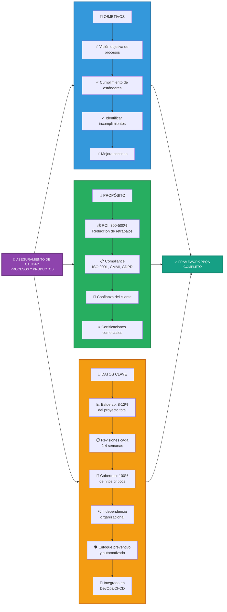
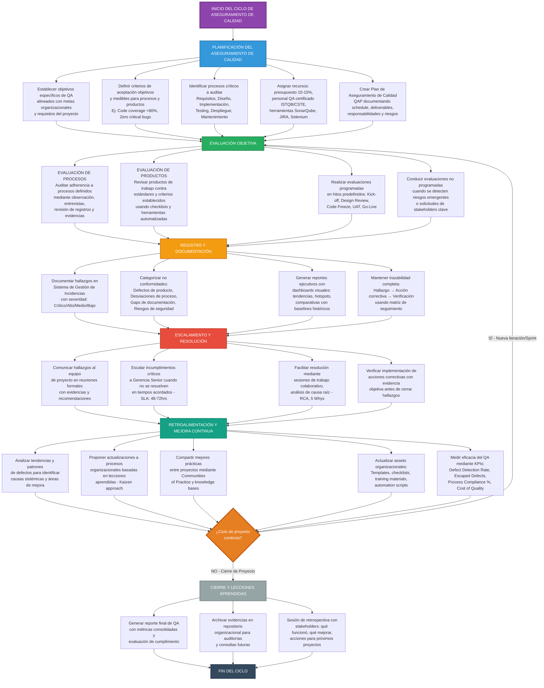

# Topico_Ing_Software

# Diagrama 1

```mermaid
graph LR
    START[🎯 ASEGURAMIENTO DE CALIDAD<br/>PROCESOS Y PRODUCTOS]
    
    START --> OBJ
    START --> PROP
    START --> NOTAS
    
    subgraph OBJ[" "]
        direction TB
        O1[📌 OBJETIVOS]
        O1 --> O2[✓ Visión objetiva de procesos]
        O2 --> O3[✓ Cumplimiento de estándares]
        O3 --> O4[✓ Identificar incumplimientos]
        O4 --> O5[✓ Mejora continua]
    end
    
    subgraph PROP[" "]
        direction TB
        P1[🎯 PROPÓSITO]
        P1 --> P2[💰 ROI: 300-500%<br/>Reducción de retrabajos]
        P2 --> P3[📋 Compliance<br/>ISO 9001, CMMI, GDPR]
        P3 --> P4[🤝 Confianza del cliente]
        P4 --> P5[⭐ Certificaciones comerciales]
    end
    
    subgraph NOTAS[" "]
        direction TB
        N1[📝 DATOS CLAVE]
        N1 --> N2[📊 Esfuerzo: 8-12%<br/>del proyecto total]
        N2 --> N3[⏱️ Revisiones cada<br/>2-4 semanas]
        N3 --> N4[🎯 Cobertura: 100%<br/>de hitos críticos]
        N4 --> N5[🔍 Independencia<br/>organizacional]
        N5 --> N6[🛡️ Enfoque preventivo<br/>y automatizado]
        N6 --> N7[🔄 Integrado en<br/>DevOps/CI-CD]
    end
    
    OBJ --> END
    PROP --> END
    NOTAS --> END
    
    END[✅ FRAMEWORK PPQA COMPLETO]
    
    style START fill:#8E44AD,stroke:#6C3483,stroke-width:4px,color:#FFF,font-size:14px
    style OBJ fill:#3498DB,stroke:#2874A6,stroke-width:3px,color:#000
    style PROP fill:#27AE60,stroke:#1E8449,stroke-width:3px,color:#000
    style NOTAS fill:#F39C12,stroke:#CA6F1E,stroke-width:3px,color:#000
    style END fill:#16A085,stroke:#138D75,stroke-width:4px,color:#FFF,font-size:14px
```

# Diagrama 2

```mermaid
graph TB
    START[INICIO DEL CICLO DE ASEGURAMIENTO DE CALIDAD]
    
    START --> PLAN[PLANIFICACIÓN DEL ASEGURAMIENTO DE CALIDAD]
    
    PLAN --> PLAN1[Establecer objetivos específicos de QA<br/>alineados con metas organizacionales<br/>y requisitos del proyecto]
    PLAN --> PLAN2[Definir criterios de aceptación objetivos<br/>y medibles para procesos y productos<br/>Ej: Code coverage >80%, Zero critical bugs]
    PLAN --> PLAN3[Identificar procesos críticos a auditar<br/>Requisitos, Diseño, Implementación,<br/>Testing, Despliegue, Mantenimiento]
    PLAN --> PLAN4[Asignar recursos: presupuesto 10-15%,<br/>personal QA certificado ISTQB/CSTE,<br/>herramientas SonarQube, JIRA, Selenium]
    PLAN --> PLAN5[Crear Plan de Aseguramiento de Calidad<br/>QAP documentando schedule, deliverables,<br/>responsabilidades y riesgos]
    
    PLAN1 & PLAN2 & PLAN3 & PLAN4 & PLAN5 --> EVAL
    
    EVAL[EVALUACIÓN OBJETIVA]
    
    EVAL --> EVAL1[EVALUACIÓN DE PROCESOS<br/>Auditar adherencia a procesos definidos<br/>mediante observación, entrevistas,<br/>revisión de registros y evidencias]
    EVAL --> EVAL2[EVALUACIÓN DE PRODUCTOS<br/>Revisar productos de trabajo contra<br/>estándares y criterios establecidos<br/>usando checklists y herramientas automatizadas]
    EVAL --> EVAL3[Realizar evaluaciones programadas<br/>en hitos predefinidos: Kick-off, Design Review,<br/>Code Freeze, UAT, Go-Live]
    EVAL --> EVAL4[Conducir evaluaciones no programadas<br/>cuando se detecten riesgos emergentes<br/>o solicitudes de stakeholders clave]
    
    EVAL1 & EVAL2 & EVAL3 & EVAL4 --> REG
    
    REG[REGISTRO Y DOCUMENTACIÓN]
    
    REG --> REG1[Documentar hallazgos en<br/>Sistema de Gestión de Incidencias<br/>con severidad: Crítico/Alto/Medio/Bajo]
    REG --> REG2[Categorizar no conformidades:<br/>Defectos de producto, Desviaciones de proceso,<br/>Gaps de documentación, Riesgos de seguridad]
    REG --> REG3[Generar reportes ejecutivos con<br/>dashboards visuales: tendencias, hotspots,<br/>comparativas con baselines históricos]
    REG --> REG4[Mantener trazabilidad completa:<br/>Hallazgo → Acción correctiva → Verificación<br/>usando matriz de seguimiento]
    
    REG1 & REG2 & REG3 & REG4 --> ESC
    
    ESC[ESCALAMIENTO Y RESOLUCIÓN]
    
    ESC --> ESC1[Comunicar hallazgos al equipo<br/>de proyecto en reuniones formales<br/>con evidencias y recomendaciones]
    ESC --> ESC2[Escalar incumplimientos críticos<br/>a Gerencia Senior cuando no se resuelven<br/>en tiempos acordados - SLA: 48-72hrs]
    ESC --> ESC3[Facilitar resolución mediante<br/>sesiones de trabajo colaborativo,<br/>análisis de causa raíz - RCA, 5 Whys]
    ESC --> ESC4[Verificar implementación de<br/>acciones correctivas con evidencia<br/>objetiva antes de cerrar hallazgos]
    
    ESC1 & ESC2 & ESC3 & ESC4 --> RET
    
    RET[RETROALIMENTACIÓN Y MEJORA CONTINUA]
    
    RET --> RET1[Analizar tendencias y patrones<br/>de defectos para identificar<br/>causas sistémicas y áreas de mejora]
    RET --> RET2[Proponer actualizaciones a procesos<br/>organizacionales basadas en lecciones<br/>aprendidas - Kaizen approach]
    RET --> RET3[Compartir mejores prácticas<br/>entre proyectos mediante Communities<br/>of Practice y knowledge bases]
    RET --> RET4[Actualizar assets organizacionales:<br/>Templates, checklists, training materials,<br/>automation scripts]
    RET --> RET5[Medir eficacia del QA mediante KPIs:<br/>Defect Detection Rate, Escaped Defects,<br/>Process Compliance %, Cost of Quality]
    
    RET1 & RET2 & RET3 & RET4 & RET5 --> DECISION{¿Ciclo de proyecto<br/>continúa?}
    
    DECISION -->|SÍ - Nueva Iteración/Sprint| EVAL
    DECISION -->|NO - Cierre de Proyecto| CLOSE
    
    CLOSE[CIERRE Y LECCIONES APRENDIDAS]
    CLOSE --> CLOSE1[Generar reporte final de QA<br/>con métricas consolidadas y<br/>evaluación de cumplimiento]
    CLOSE --> CLOSE2[Archivar evidencias en repositorio<br/>organizacional para auditorías<br/>y consultas futuras]
    CLOSE --> CLOSE3[Sesión de retrospectiva con<br/>stakeholders: qué funcionó, qué mejorar,<br/>acciones para próximos proyectos]
    
    CLOSE1 & CLOSE2 & CLOSE3 --> END[FIN DEL CICLO]
    
    style START fill:#8E44AD,stroke:#6C3483,stroke-width:3px,color:#FFF
    style PLAN fill:#3498DB,stroke:#2874A6,stroke-width:2px,color:#FFF
    style EVAL fill:#27AE60,stroke:#1E8449,stroke-width:2px,color:#FFF
    style REG fill:#F39C12,stroke:#CA6F1E,stroke-width:2px,color:#FFF
    style ESC fill:#E74C3C,stroke:#C0392B,stroke-width:2px,color:#FFF
    style RET fill:#16A085,stroke:#138D75,stroke-width:2px,color:#FFF
    style DECISION fill:#E67E22,stroke:#BA4A00,stroke-width:3px,color:#FFF
    style CLOSE fill:#95A5A6,stroke:#707B7C,stroke-width:2px,color:#FFF
    style END fill:#34495E,stroke:#2C3E50,stroke-width:3px,color:#FFF
```

# Diagrama 3

```mermaid
graph TD
    START[🎯 PROCESO DE ASEGURAMIENTO DE CALIDAD]
    
    START --> ESTRATEGIA
    
    subgraph ESTRATEGIA[" "]
        direction TB
        A1[👔 ALTA DIRECCIÓN]
        A1 --> A2[Define políticas y presupuesto de calidad]
        A2 --> A3[Aprueba estándares organizacionales]
    end
    
    ESTRATEGIA --> GESTION
    
    subgraph GESTION[" "]
        direction TB
        B1[👨‍💼 DIRECTOR DE CALIDAD]
        B1 --> B2[Establece estrategia y métricas de QA]
        B2 --> B3[Lidera equipo de aseguramiento]
    end
    
    GESTION --> PROYECTO
    
    subgraph PROYECTO[" "]
        direction TB
        C1[📊 JEFE DE PROYECTO]
        C1 --> C2[Integra QA en cronograma]
        C2 --> C3[📝 PRODUCT OWNER]
        C3 --> C4[Define criterios de aceptación]
        C4 --> C5[🏗️ ARQUITECTO]
        C5 --> C6[Establece estándares técnicos]
    end
    
    PROYECTO --> DESARROLLO
    
    subgraph DESARROLLO[" "]
        direction TB
        D1[💻 EQUIPO DE DESARROLLO]
        D1 --> D2[Implementa funcionalidades y unit tests]
        D2 --> D3[Ejecuta code reviews]
        D3 --> D4[🚀 INGENIERO DEVOPS]
        D4 --> D5[Configura CI/CD con quality gates]
    end
    
    DESARROLLO --> QA
    
    subgraph QA[" "]
        direction TB
        E1[🔍 EQUIPO DE QA]
        E1 --> E2[Ejecuta auditorías de procesos]
        E2 --> E3[Realiza pruebas funcionales y automatizadas]
        E3 --> E4[Reporta defectos y valida correcciones]
        E4 --> E5[🔐 ESPECIALISTA SEGURIDAD]
        E5 --> E6[Ejecuta pruebas de seguridad SAST/DAST]
    end
    
    QA --> REPORTE
    
    subgraph REPORTE[" "]
        direction TB
        F1[📊 ANALISTA DE MÉTRICAS]
        F1 --> F2[Consolida KPIs y genera dashboards]
        F2 --> F3[Analiza tendencias de calidad]
    end
    
    REPORTE --> EXTERNOS
    
    subgraph EXTERNOS[" "]
        direction TB
        G1[🤝 CLIENTE]
        G1 --> G2[Participa en UAT y aprueba releases]
        G2 --> G3[✅ AUDITOR EXTERNO]
        G3 --> G4[Valida compliance y emite certificaciones]
    end
    
    EXTERNOS --> FIN
    
    FIN[🔄 MEJORA CONTINUA]
    FIN -.->|Feedback| B1
    
    style START fill:#8E44AD,stroke:#6C3483,stroke-width:4px,color:#FFF,font-size:16px
    style ESTRATEGIA fill:#3498DB,stroke:#2874A6,stroke-width:3px,color:#000
    style GESTION fill:#1ABC9C,stroke:#148F77,stroke-width:3px,color:#000
    style PROYECTO fill:#27AE60,stroke:#1E8449,stroke-width:3px,color:#000
    style DESARROLLO fill:#F39C12,stroke:#CA6F1E,stroke-width:3px,color:#000
    style QA fill:#E74C3C,stroke:#C0392B,stroke-width:3px,color:#000
    style REPORTE fill:#9B59B6,stroke:#7D3C98,stroke-width:3px,color:#000
    style EXTERNOS fill:#34495E,stroke:#2C3E50,stroke-width:3px,color:#FFF
    style FIN fill:#16A085,stroke:#138D75,stroke-width:4px,color:#FFF,font-size:16px
```

# Diagrama 4

```mermaid
graph TD
    START[🎯 STACK TECNOLÓGICO DE ASEGURAMIENTO DE CALIDAD]
    
    START --> CAPA1
    
    subgraph CAPA1[" "]
        direction TB
        A1[📊 DASHBOARDS Y REPORTES]
        A1 --> A2[Power BI / Grafana]
        A2 --> A3[Métricas en tiempo real y tendencias]
    end
    
    CAPA1 --> CAPA2
    
    subgraph CAPA2[" "]
        direction TB
        B1[📋 GESTIÓN DE PROYECTOS]
        B1 --> B2[JIRA / Azure DevOps]
        B2 --> B3[Seguimiento de defectos y sprints]
        B3 --> B4[TestRail / Zephyr]
        B4 --> B5[Gestión de casos de prueba]
    end
    
    CAPA2 --> CAPA3
    
    subgraph CAPA3[" "]
        direction TB
        C1[💻 ANÁLISIS DE CÓDIGO]
        C1 --> C2[SonarQube]
        C2 --> C3[Code quality, cobertura >80%, quality gates]
        C3 --> C4[GitHub / GitLab]
        C4 --> C5[Code reviews y pull requests]
    end
    
    CAPA3 --> CAPA4
    
    subgraph CAPA4[" "]
        direction TB
        D1[🧪 PRUEBAS AUTOMATIZADAS]
        D1 --> D2[JUnit / pytest - Pruebas unitarias]
        D2 --> D3[Postman / RestAssured - Pruebas de APIs]
        D3 --> D4[Selenium / Cypress - Pruebas E2E]
        D4 --> D5[JMeter / Gatling - Pruebas de rendimiento]
    end
    
    CAPA4 --> CAPA5
    
    subgraph CAPA5[" "]
        direction TB
        E1[🔐 SEGURIDAD]
        E1 --> E2[Fortify / Checkmarx - SAST]
        E2 --> E3[OWASP ZAP - DAST]
        E3 --> E4[Snyk / Dependabot - Análisis de dependencias]
        E4 --> E5[HashiCorp Vault - Gestión de secretos]
    end
    
    CAPA5 --> CAPA6
    
    subgraph CAPA6[" "]
        direction TB
        F1[🚀 CI/CD Y DESPLIEGUE]
        F1 --> F2[Jenkins / GitHub Actions]
        F2 --> F3[Pipeline automatizado con quality gates]
        F3 --> F4[Docker / Kubernetes]
        F4 --> F5[Contenedores y orquestación]
        F5 --> F6[Prometheus / Datadog]
        F6 --> F7[Monitoreo y observabilidad]
    end
    
    CAPA6 --> CAPA7
    
    subgraph CAPA7[" "]
        direction TB
        G1[💾 DATOS Y CUMPLIMIENTO]
        G1 --> G2[PostgreSQL / MongoDB - Bases de datos encriptadas]
        G2 --> G3[TLS 1.3 / AES-256 - Encriptación]
        G3 --> G4[OAuth 2.0 / JWT - Autenticación]
        G4 --> G5[GDPR / ISO 27001 - Cumplimiento normativo]
    end
    
    CAPA7 --> CAPA8
    
    subgraph CAPA8[" "]
        direction TB
        H1[🔔 NOTIFICACIONES]
        H1 --> H2[Slack / MS Teams]
        H2 --> H3[Alertas en tiempo real de issues y quality gates]
    end
    
    CAPA8 --> FIN
    
    FIN[✅ CICLO COMPLETO INTEGRADO]
    FIN -.->|Métricas| A1
    
    style START fill:#8E44AD,stroke:#6C3483,stroke-width:4px,color:#FFF,font-size:16px
    style CAPA1 fill:#3498DB,stroke:#2874A6,stroke-width:3px,color:#000
    style CAPA2 fill:#1ABC9C,stroke:#148F77,stroke-width:3px,color:#000
    style CAPA3 fill:#27AE60,stroke:#1E8449,stroke-width:3px,color:#000
    style CAPA4 fill:#F39C12,stroke:#CA6F1E,stroke-width:3px,color:#000
    style CAPA5 fill:#E74C3C,stroke:#C0392B,stroke-width:3px,color:#FFF
    style CAPA6 fill:#9B59B6,stroke:#7D3C98,stroke-width:3px,color:#FFF
    style CAPA7 fill:#E67E22,stroke:#BA4A00,stroke-width:3px,color:#FFF
    style CAPA8 fill:#34495E,stroke:#2C3E50,stroke-width:3px,color:#FFF
    style FIN fill:#16A085,stroke:#138D75,stroke-width:4px,color:#FFF,font-size:16px
```
    
