# Aseguramiento de calidad de procesos y productos

# Diagrama 1

```mermaid
graph TD
    A[🎯 ASEGURAMIENTO DE CALIDAD<br/>PROCESOS Y PRODUCTOS]
    A --> B1[📌 OBJETIVOS]
    A --> B2[🎯 PROPÓSITO]
    A --> B3[📠NOTAS CLAVE]

    B1 --> C1[Visión objetiva de procesos]
    B1 --> C2[Cumplimiento de estándares]
    B1 --> C3[Mejora continua]

    B2 --> C4[Reducción de retrabajos]
    B2 --> C5[Compliance ISO/CMMI/GDPR]
    B2 --> C6[Confianza del cliente]

    B3 --> C7[Esfuerzo: 8-12% del proyecto]
    B3 --> C8[Revisiones periódicas]
    B3 --> C9[Integrado en DevOps/CI-CD]

    style A fill:#2C3E50,stroke:#1A252F,stroke-width:4px,color:#FFF
    style B1 fill:#3498DB,stroke:#2874A6,color:#FFF
    style B2 fill:#27AE60,stroke:#1E8449,color:#FFF
    style B3 fill:#E67E22,stroke:#CA6F1E,color:#FFF

```



# Diagrama 2

```mermaid
graph TD
    A[🎯 INICIO DEL CICLO QA]

    A --> B[📘 Planificación]
    A --> C[🔠Evaluación]
    A --> D[📠Registro]
    A --> E[âš ï¸ Escalamiento]
    A --> F[â™»ï¸ Mejora Continua]
    A --> G{ⓠ¿Continúa el proyecto?}
    G -->|Sí| C
    G -->|No| H[📦 Cierre]

    B --> B1[Definir objetivos QA]
    B --> B2[Criterios medibles]
    B --> B3[Procesos críticos]
    B --> B4[Recursos y herramientas]

    C --> C1[Auditoría de procesos]
    C --> C2[Evaluación de productos]
    C --> C3[Revisiones en hitos]

    D --> D1[Registrar hallazgos]
    D --> D2[Clasificar no conformidades]
    D --> D3[Reportes ejecutivos]

    E --> E1[Comunicación al equipo]
    E --> E2[Escalar a gerencia]
    E --> E3[Resolución colaborativa]

    F --> F1[Analizar tendencias]
    F --> F2[Actualizar procesos]
    F --> F3[Compartir buenas prácticas]
    F --> F4[Medir KPIs]

    H --> H1[Reporte final QA]
    H --> H2[Archivar evidencias]
    H --> H3[Retrospectiva con stakeholders]

    style A fill:#2C3E50,stroke:#1A252F,stroke-width:4px,color:#FFF
    style B fill:#3498DB,stroke:#2874A6,color:#FFF
    style C fill:#27AE60,stroke:#1E8449,color:#FFF
    style D fill:#F39C12,stroke:#CA6F1E,color:#FFF
    style E fill:#E74C3C,stroke:#C0392B,color:#FFF
    style F fill:#16A085,stroke:#138D75,color:#FFF
    style G fill:#E67E22,stroke:#BA4A00,color:#FFF
    style H fill:#95A5A6,stroke:#707B7C,color:#FFF

```



# Diagrama 3

```mermaid
graph TD
    A[🎯 Proceso de Aseguramiento de Calidad]

    %% Alta Dirección
    A --> B[👔 Alta Dirección]
    B --> B1[Define políticas y presupuesto]
    B --> B2[Aprueba estándares]

    %% Dirección de Calidad
    A --> C[👨‍💼 Dirección de Calidad]
    C --> C1[Estrategia y métricas]
    C --> C2[Lidera equipo QA]

    %% Jefe de Proyecto
    A --> D[📊 Jefe de Proyecto]
    D --> D1[Integra QA en cronograma]
    D --> D2[📝 Product Owner - Define criterios]
    D --> D3[🏗️ Arquitecto - Estándares técnicos]

    %% Desarrollo
    A --> E[💻 Desarrollo]
    E --> E1[Implementación y unit tests]
    E --> E2[Code reviews]
    E --> E3[🚀 DevOps - CI/CD + quality gates]

    %% QA
    A --> F[🔍 QA]
    F --> F1[Auditorías de procesos]
    F --> F2[Pruebas funcionales y automatizadas]
    F --> F3[🔐 Seguridad - SAST/DAST]

    %% Reporte de métricas
    A --> G[📊 Reporte de Métricas]
    G --> G1[KPIs y dashboards]
    G --> G2[Análisis de tendencias]

    %% Externos
    A --> H[🤝 Externos]
    H --> H1[Cliente - UAT y releases]
    H --> H2[✅ Auditor externo - Compliance]

    %% Mejora Continua
    H --> I[🔄 Mejora Continua]

    %% Conexiones cruzadas
    B --> D   %% Alta Dirección ↔ Jefe de Proyecto
    C --> D   %% Dirección de Calidad ↔ Jefe de Proyecto
    C --> E   %% Dirección de Calidad ↔ Desarrollo
    C --> F   %% Dirección de Calidad ↔ QA
    F --> D   %% QA ↔ Jefe de Proyecto
    F --> E   %% QA ↔ Desarrollo
    F --> D2  %% QA ↔ Product Owner
    I -.-> B  %% Mejora Continua retroalimenta Alta Dirección
    I -.-> C  %% Mejora Continua retroalimenta Dirección de Calidad
    I -.-> D  %% Mejora Continua retroalimenta Jefe de Proyecto
    I -.-> E  %% Mejora Continua retroalimenta Desarrollo
    I -.-> F  %% Mejora Continua retroalimenta QA
    I -.-> G  %% Mejora Continua retroalimenta Reporte

    %% Estilos
    style A fill:#2C3E50,stroke:#1A252F,stroke-width:4px,color:#FFF
    style B fill:#2980B9,stroke:#1F618D,color:#FFF
    style C fill:#27AE60,stroke:#1E8449,color:#FFF
    style D fill:#27AE60,stroke:#1E8449,color:#FFF
    style E fill:#27AE60,stroke:#1E8449,color:#FFF
    style F fill:#C0392B,stroke:#922B21,color:#FFF
    style G fill:#9B59B6,stroke:#7D3C98,color:#FFF
    style H fill:#7F8C8D,stroke:#626567,color:#FFF
    style I fill:#16A085,stroke:#117864,stroke-width:3px,color:#FFF
```


# Diagrama 4


    
